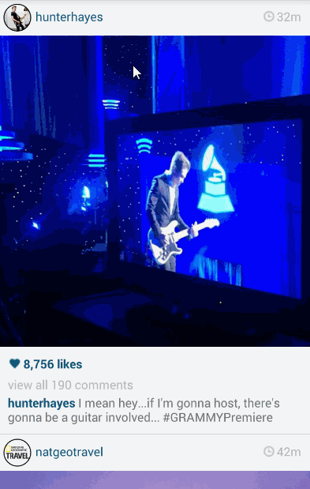

# InstagramPhotoViewer
[Week 1 Project: Instagram Photo Viewer.](http://courses.codepath.com/courses/intro_to_android/week/1#!assignment)

Time spent: 17 hours in total

Completed user stories:

 * [x] Required: User can scroll through current popular photos from Instagram
 * [x] Required: For each photo displayed, user can see the following details
<ul>
	<li>Graphic, Caption, Username</li>
	<li>(Optional) relative timestamp, like count, user profile image</li>
</ul>
 * [x] Advanced: Add pull-to-refresh for popular stream with SwipeRefreshLayout
 * [x] Advanced: Display each photo with the same style and proportions as the real Instagram (see screens below)
 * [x] Advanced: Display each user profile image using a RoundedImageView
 * [x] Advanced: Display a nice default placeholder graphic for each image during loading (read more about Picasso)
 * [x] Advanced: Improve the user interface through styling and coloring
 * [x] Bonus: Allow user to view all comments for an image within a dialog fragment

Walkthrough of all user stories:

GIF created with [LiceCap](http://www.cockos.com/licecap/).

